# 系统设计文档（System Design Document）

## 1.定义和缩写词

## 2.系统架构设计

Kiwi数据智能体架构具备以下特点：

- 运用多个智能体（GenAI 智能体）和嵌入技术（embeddings）来理解用户以自然语言提出的查询。
- 借助领域嵌入、指标与维度元数据嵌入、**维度数据嵌入**，以及关于这些元素的定义信息和所使用术语的分类体系。
- 通过示例和反馈循环不断优化其对查询的理解能力和准确性。
- 将自然语言查询转化为可针对领域（Domain）执行的查询，并利用执行层来获取查询结果。

### 2.1业务架构图

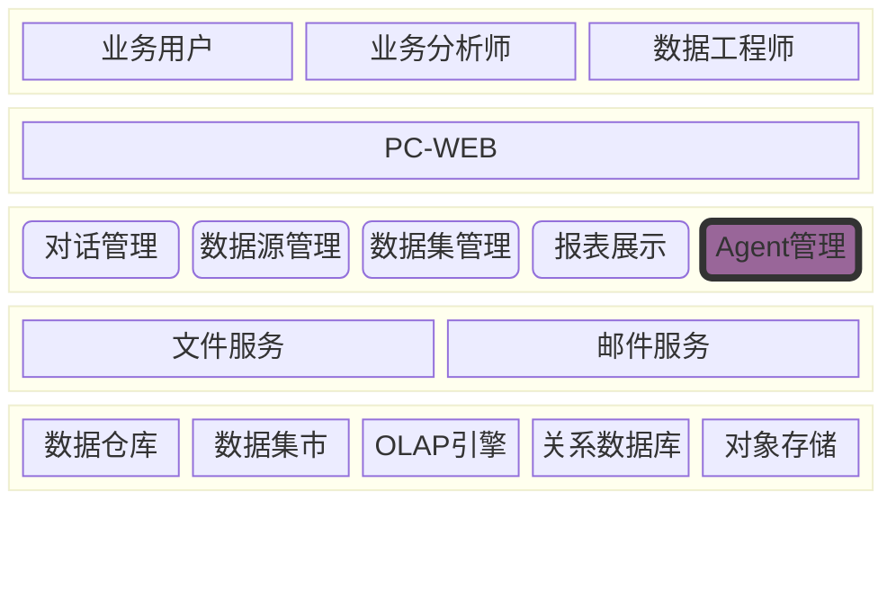

### 2.2技术架构图

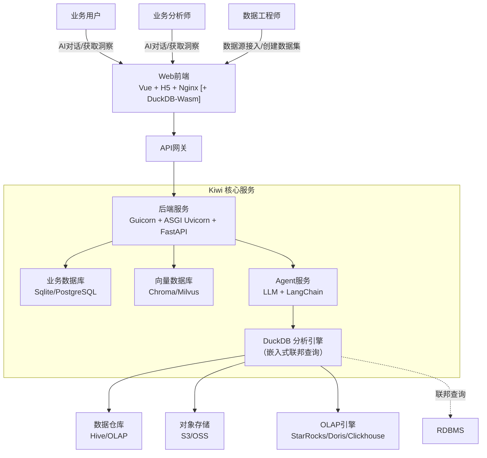

- FastAPI + Uvicorn 提供高性能异步 API
- Gunicorn 负责多进程管理，提高并发
- Nginx 反向代理，支持负载均衡 & HTTPS

### 2.3 组件图

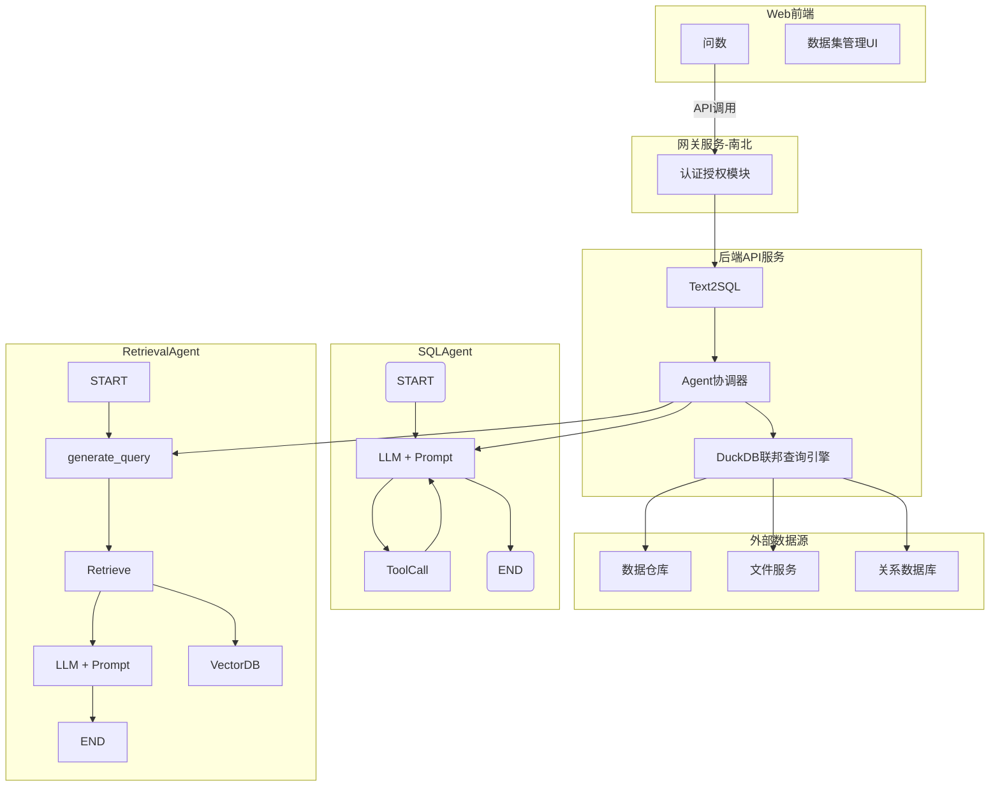

#### 数据集配置工作流

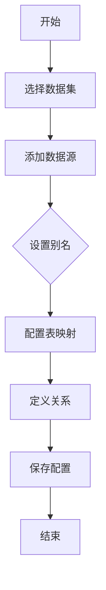

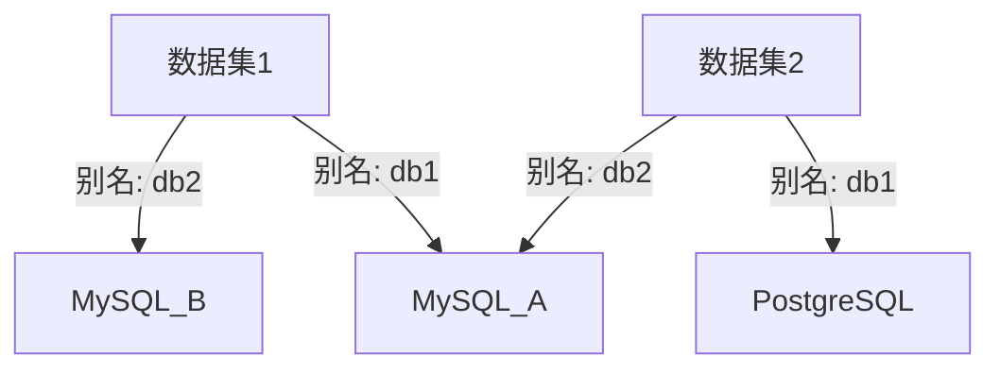

- 不同数据集可以使用相同别名指向不同数据源

- 同一数据源在不同数据集可以使用不同别名

#### Agent管理流程：

#### DuckDB联邦查询扩展数据源：

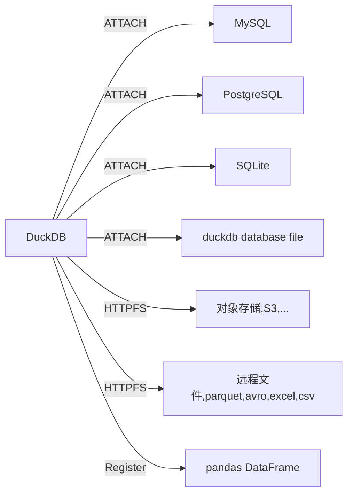

DuckDB联邦查询流程：

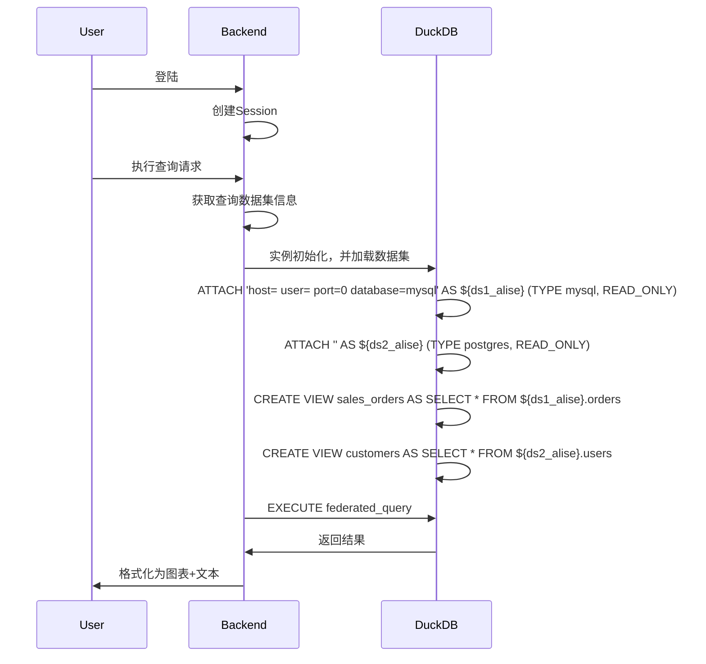

- 创建session，创建map,记录数据集与duckdb实例关系
- 查看数据集对应的duckdb实例是否存在，不存在创建一个新的duckdb实例
- duckdb实例初始化，加载数据集中的数据库与表
    - Non-Materialization Attach方式访问远程数据库
    - Materialization： 创建内存表，将远程数据库表数据同步到duckdb实例内存中

> 注意： 确保在duckdb实例中数据库名称唯一

#### 权限控制流程

**数据集权限控制**

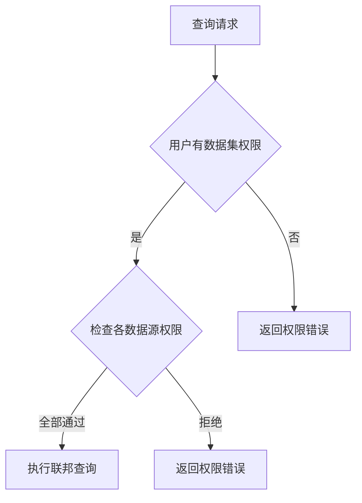

### 代码图

#### API接口

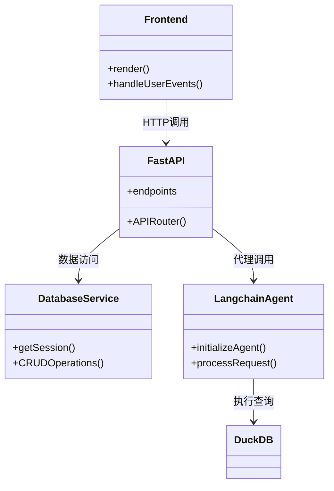

#### 联邦查询引擎

部分代码（Pseudo）:

```text
class FederatedQueryEngine:
    def execute(self, dataset_id: int, sql: str):
        # 获取数据集配置
        dataset = get_dataset(dataset_id)
        
        # 获取关联数据源
        data_sources = get_dataset_sources(dataset_id)
        
        # 创建DuckDB连接
        conn = duckdb.connect()
        
        # 附加所有数据源
        for ds in data_sources:
            conn.execute(f"""
                ATTACH '{self._build_connection_string(ds)}' 
                AS {ds.alias} (TYPE {ds.type})
            """)
        
        # 创建表映射视图
        for mapping in dataset.config["table_mappings"]:
            conn.execute(f"""
                CREATE VIEW {mapping['target_name']} AS 
                SELECT * FROM {mapping['source_alias']}.{mapping['source_table']}
            """)
        
        # 执行查询
        return conn.execute(sql).fetchdf()
    
    def _build_connection_string(self, data_source):
        config = json.loads(data_source.connection_config)
        if data_source.type == "mysql":
            return f"mysql://{config['user']}:{config['password']}@{config['host']}:{config['port']}/{config['database']}"
        # 其他数据库类型处理...
```

#### 权限检验

数据集权限验证部分代码（Pseudo）

```text
def check_query_permission(user, dataset_id, sql):
    # 1. 验证数据集权限
    if not has_dataset_access(user, dataset_id):
        raise PermissionDenied("No dataset access")
    
    # 2. 获取数据集关联的所有数据源
    data_sources = get_dataset_sources(dataset_id)
    
    # 3. 解析SQL中使用的表
    used_tables = parse_sql_tables(sql)
    
    # 4. 验证每个表对应的数据源权限
    for table in used_tables:
        ds_alias = table.split('.')[0]  # 从db.table中提取别名
        data_source = next(ds for ds in data_sources if ds.alias == ds_alias)
        
        if not has_data_source_access(user, data_source.id):
            # 权限不足时进行脱敏处理
            sql = apply_data_masking(sql, table)
    
    return sql
```

## 3.功能模块设计

### 用户管理-认证与授权

使用FastAPI依赖注入实现权限中间件

### 项目管理

* 项目为核心组织单元

* 数据源、数据集、Agent和对话都归属特定项目

### 数据源管理

支持的数据源类型：

- 关系数据库
    - SQLite
    - MySQL
    - PostgreSQL
- 数据仓库
    - Impala
    - Hive
- OLAP引擎
    - DuckDB
    - StarRocks
- 文件服务
    - S3
    - SFTP

### 数据集管理

### Agent管理

版本回滚流程(P0)：

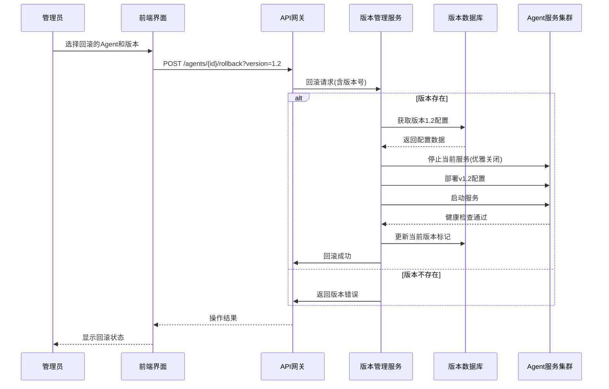

代码实现（Pseudo）

```text
@app.post("/agents/{agent_id}/rollback")
async def rollback_agent(
        agent_id: int,
        version: str,
        current_user: User = Depends(get_current_admin)
):
    # 验证权限
    if not has_permission(current_user, agent_id, "ADMIN"):
        raise HTTPException(403, "权限不足")

    # 获取目标版本
    target_version = await VersionRepo.get_version(agent_id, version)
    if not target_version:
        raise HTTPException(404, "版本不存在")

    # 执行回滚
    try:
        # 停止当前服务
        await AgentService.stop(agent_id)

        # 应用历史配置
        await AgentService.apply_config(
            agent_id,
            target_version.config
        )

        # 启动服务
        await AgentService.start(agent_id)

        # 更新当前版本标记
        await VersionRepo.set_current_version(
            agent_id,
            target_version.id
        )

        # 记录审计日志
        await AuditLog.record(
            user_id=current_user.id,
            action="AGENT_ROLLBACK",
            target_type="AGENT",
            target_id=agent_id,
            details=f"回滚到版本 {version}"
        )

        return {"status": "success", "version": version}

    except RollbackException as e:
        # 自动恢复机制
        await AgentService.emergency_restore(agent_id)
        raise HTTPException(500, f"回滚失败: {str(e)}")
```

测试沙盒环境（P1）
**环境隔离**：

- 独立数据库实例（SQLite内存数据库或专用Docker容器）
- 网络隔离：沙盒环境无法访问生产数据源

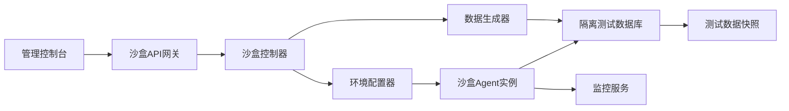

```sql
CREATE TABLE sandbox_environment (
    id BIGSERIAL PRIMARY KEY,
    name VARCHAR(100) NOT NULL,
    agent_id INTEGER NOT NULL REFERENCES agent(id),
    base_version VARCHAR(20) NOT NULL,
    config_overrides JSONB,      -- 要测试的配置变更
    data_snapshot_id INTEGER REFERENCES data_snapshot(id),
    creator_id INTEGER NOT NULL REFERENCES users(id),
    created_at TIMESTAMPTZ DEFAULT NOW(),
    status VARCHAR(20) CHECK(status IN ('CREATING','ACTIVE','EXPIRED'))
);

CREATE TABLE sandbox_test_case (
    id BIGSERIAL PRIMARY KEY,
    sandbox_id INTEGER NOT NULL REFERENCES sandbox_environment(id),
    input TEXT NOT NULL,         -- 测试输入（自然语言）
    expected_sql TEXT,           -- 预期SQL模式（可选）
    expected_schema JSONB,       -- 预期结果模式（可选）
    created_at TIMESTAMPTZ DEFAULT NOW()
);
```

沙盒工作流程：

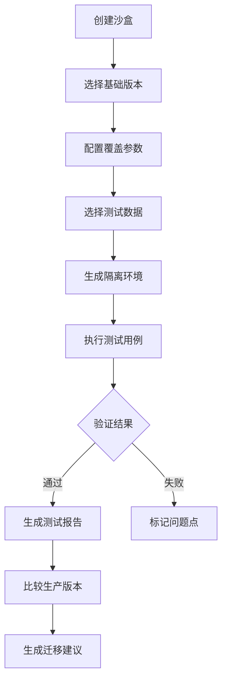

测试沙盒API设计

| 端点                      | 方法   | 功能       |
|-------------------------|------|----------|
| /sandboxes              | POST | 创建新沙盒环境  |
| /sandboxes/{id}         | GET  | 获取沙盒详情   |
| /sandboxes/{id}/execute | POST | 执行测试用例   |
| /sandboxes/{id}/execute | POST | 添加测试用例   |
| /sandboxes/{id}/promote | POST | 将配置提升到生产 |

数据隔离策略：

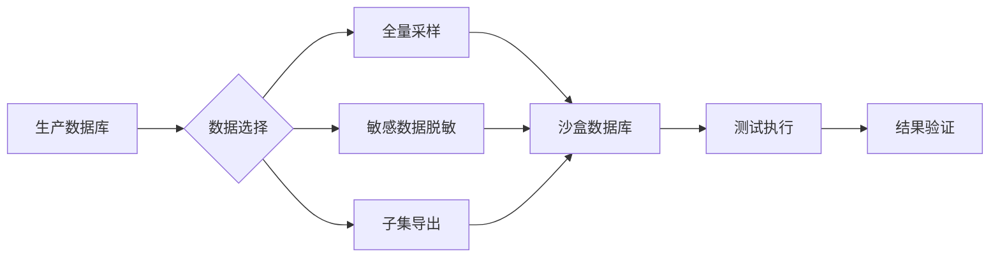

版本与沙盒集成设计

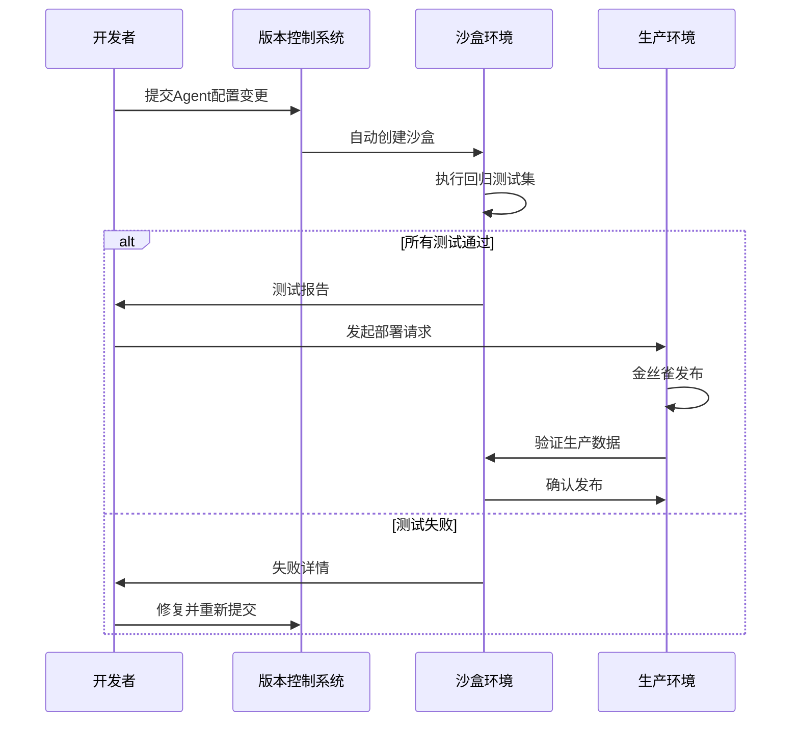

沙盒安全控制

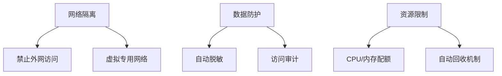

### 对话管理

* 创建会话 → 发送消息 → 获取Agent响应 → 提交反馈
* 消息包含生成的SQL、查询结果和可视化配置

对话流程如下:

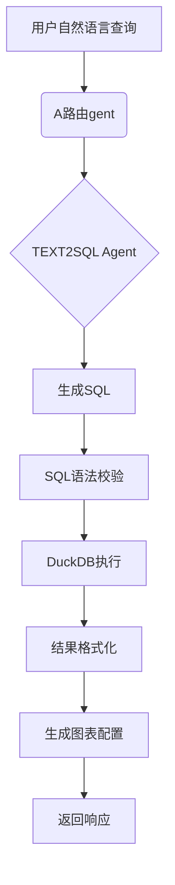

时序图：
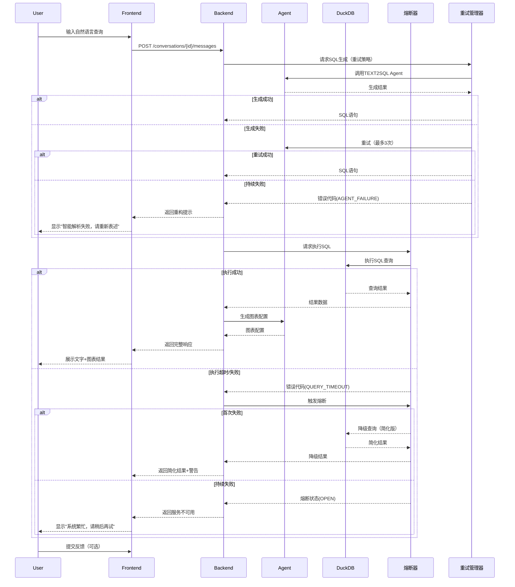

### 数据查询优化

使用DuckDB内存引擎加速查询

SQL执行前进行安全校验（防止DROP等危险操作）

查询结果缓存机制

## 4.接口设计(OpenAPI 3.0规范)

* 认证管理

```html
# POST /auth/login
# 请求: { "username": "user1", "password": "pass123" }
# 响应: { "access_token": "jwt_token", "token_type": "bearer" }

# POST /auth/logout
# 头部: Authorization: Bearer
<token>

    # GET /auth/me
    # 响应: { "id": 1, "username": "user1", "roles": ["项目管理员"] }
```

* 项目管理

```html
# POST /projects
# 请求: { "name": "销售分析", "description": "销售数据仪表盘" }
# 响应: 201 Created + 项目ID

# GET /projects
# 响应: [{ "id": 1, "name": "销售分析", "owner": "user1" }]

# GET /projects/{project_id}
# 响应: 项目详情+成员列表
```

* 数据源管理

```html
# POST /projects/{project_id}/data-sources
# 请求: {
#   "name": "生产数据库",
#   "type": "MySQL",
#   "connection_config": {"host":"db.example.com","port":3306,...}
# }
# 响应: 201 Created + 数据源ID

# GET /projects/{project_id}/data-sources
# 响应: 数据源列表
```

* 数据集管理

```html
# POST /projects/{project_id}/datasets
# 请求: {
#   "name": "销售数据集",
#   "data_source_id": 1,
#   "configuration": {"tables":["sales"], "columns":[...]}
# }
# 响应: 201 Created + 数据集ID

# GET /datasets/{dataset_id}
# 响应: 数据集详情+元数据
```

* Agent管理

```html
# POST /projects/{project_id}/agents
# 请求: {
#   "name": "SQL生成Agent",
#   "type": "TEXT2SQL",
#   "config": {"model":"gpt-4","temperature":0.7}
# }
# 响应: 201 Created + Agent ID
```

* 对话管理

```html
# POST /projects/{project_id}/conversations
# 请求: { "title": "Q3销售分析" }
# 响应: 201 Created + 会话ID

# POST /conversations/{conversation_id}/messages
# 请求: {
#   "content": "显示2023年Q3各产品销量",
#   "agent_id": 1  # 指定使用的Agent
# }
# 响应: {
#   "message_id": 123,
#   "sql": "SELECT ...",  # 生成的SQL
#   "data": [...],        # 查询结果
#   "report": {...}       # 图表配置
# }

# GET /conversations/{conversation_id}/messages
# 响应: 对话历史消息列表
```

* 反馈接口

```html
# POST /messages/{message_id}/feedback
# 请求: { "feedback": 1 }  # 1=喜欢, 0=不喜欢
# 响应: 204 No Content
```

* 权限管理

```html
# POST /projects/{project_id}/members
# 请求: { "user_id": 2, "role_id": 3 }  # 添加成员
# 响应: 201 Created

# DELETE /projects/{project_id}/members/{user_id}
# 响应: 204 No Content
```

## 安全设计

认证机制：

* 使用JWT Bearer Token进行认证

* /auth/login 获取访问令牌

* 所有受保护端点需要Authorization头

授权机制：

数据隔离确保用户只能访问所属项目

* 系统管理员：管理所有资源

* 项目管理员：管理所属项目
*
* 数据分析师：数据集管理与数据查询

* 普通用户：仅限数据查询

数据安全：

* 密码bcrypt加密存储

* SQL注入防护

* 数据隔离（项目级权限）

## 性能设计

描述系统的性能设计方案，包括优化策略，并发处理，缓存机制等。

## 扩展性设计

* 数据库层：SQLAlchemy ORM支持多数据库

* Agent类型：通过注册机制支持新Agent类型, Agent配置支持灵活参数

* 数据源连接配置：通用JSON结构适配不同数据源

* 响应格式统一化便于前端处理

## 错误处理设计

异常处理、错误恢复、日志记录

* 标准化错误响应格式

* 包含401未授权、404未找到等常见状态码

## 部署设计

包括软硬件环境，安装流程，配置管理等。